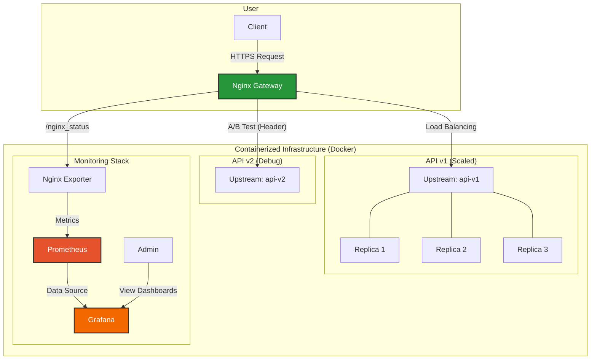

# Sentiment Recognition — README (Ayadi Raed)

## Project overview
This repository demonstrates an MLOps-style deployment that serves a pre-trained sentiment/emotion model behind an Nginx API gateway. The deployment is containerized with Docker Compose and includes two API versions (v1 and v2), HTTPS via self-signed certificates, basic-auth protection, rate limiting, A/B routing by header, and monitoring (Prometheus + Grafana).

## Architecture (quick)
- Nginx: reverse proxy, TLS termination, basic auth, rate limiting, A/B routing, exposes `/nginx_status` for scraping.
- api-v1: main FastAPI service (replicated, production behavior).
- api-v2: debug FastAPI service (returns more diagnostic info).
- nginx_exporter + Prometheus + Grafana: monitoring stack.
- model: pre-trained model stored as `model/model.joblib` loaded by each API.



## Where to find key files
- Docker Compose orchestration: `docker-compose.yml`
- Nginx configuration & certs: `deployments/nginx/nginx.conf`, `deployments/nginx/Dockerfile`, `deployments/nginx/certs/`
- API sources: `src/api/v1/main.py`, `src/api/v2/main.py`, `src/api/requirements.txt`
- Model artifact: `model/model.joblib`
- Makefile targets: `Makefile`
- Tests: `tests/run_tests.sh`

## How it works (behavior)
- All external traffic goes to Nginx. Port mappings in `docker-compose.yml` expose HTTP (80) and HTTPS (443) on the host (example binds 8080:80 and 443:443).
- HTTP (port 80) is redirected to HTTPS (443).
- TLS: self-signed certs are mounted into the nginx container at `/etc/nginx/certs/nginx.crt` and `/etc/nginx/certs/nginx.key`.
- Authentication: `/predict` is protected by Basic Auth using `/etc/nginx/.htpasswd` inside the container.
- Rate limiting: configured in `nginx.conf` via `limit_req_zone` with a rate of `10r/s` and a small burst.
- A/B routing: Nginx `map` directive routes to `api-v2` only when `X-Experiment-Group: debug` header is present; otherwise traffic goes to `api-v1`.

## API contract (both versions)
- Endpoint: `POST /predict`
- Content-Type: `application/json`
- Body schema: `{ "sentence": "text to classify" }`
- Authentication: Basic Auth (username/password) — credentials are provided via `.htpasswd` mounted into the nginx container.
- Differences:
  - `api-v1` returns the predicted label (compact response).
  - `api-v2` returns the predicted label and a `prediction_proba_dict` with per-class probabilities (debug information).

## Run the project locally (recommended)
1. Build and start all containers (background):

```bash
make start-project
```

2. Run the test suite that exercises predict, A/B routing, auth, rate-limiting, and monitoring checks:

```bash
make run-tests
# or
./tests/run_tests.sh
```

3. Useful single-test curl example (calls v1 by default):

```bash
curl -X POST "https://localhost/predict" \
  -H "Content-Type: application/json" \
  -d '{"sentence": "Oh yeah, that was soooo cool!"}' \
  --user admin:admin \
  --cacert ./deployments/nginx/certs/nginx.crt
```

To route to `api-v2` (debug) include the header:

```bash
-H "X-Experiment-Group: debug"
```

## Build details
- Each API service has a `Dockerfile` (see `src/api/v1/Dockerfile` and `src/api/v2/Dockerfile`) and shares the same `src/api/requirements.txt`.
- `docker-compose.yml` builds two API images and an Nginx image from `deployments/nginx/` and configures a 3-replica deployment for `sentiment-prediction-1-api`.

## Monitoring
- `nginx_exporter` scrapes Nginx metrics from `/nginx_status`.
- Prometheus scrapes the exporter; Grafana can be used to visualize dashboards.
- Ports exposed: Prometheus `9090`, Grafana `3000`, exporter `9113` (see `docker-compose.yml`).

## Testing and validation
- `tests/run_tests.sh` performs basic healthchecks:
  - nominal prediction (expects HTTP 200)
  - A/B routing (checks `prediction_proba_dict` returned by v2)
  - authentication failure behavior (expects HTTP 401 for wrong credentials)
  - simple rate-limiting smoke test
  - Prometheus and Grafana availability checks
- Final validation is performed by `make run-tests`.

## Notes and assumptions
- The model file `model/model.joblib` must be present and loadable by the API containers.
- Certificates in `deployments/nginx/certs` are self-signed for local testing.
- The `.htpasswd` file must be present under `deployments/nginx/.htpasswd` to enable basic auth.

## Troubleshooting
- If a container fails to start, check logs with `docker compose -p sentiment_recognition logs <service>`.
- If tests fail due to TLS/cert errors, ensure the `--cacert` option in the test curl commands points to `deployments/nginx/certs/nginx.crt`.

## Next steps you may want to implement
- Replace self-signed certificates with a trusted CA for production.
- Harden TLS ciphers and add HSTS headers.
- Add automated CI to run `make run-tests` on each PR.

---
Author: Ayadi Raed
